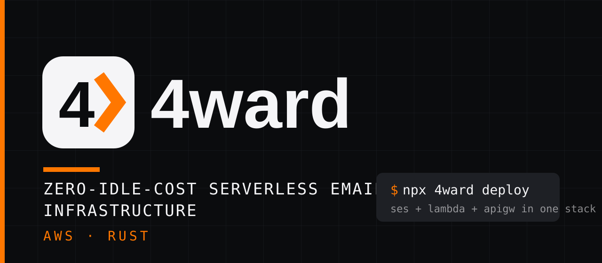
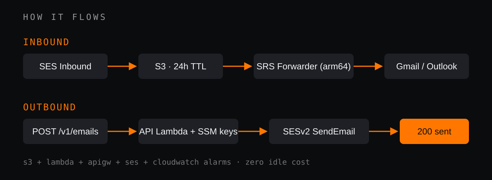

<p align="center">
  
</p>

<p align="center">
  <a href="https://github.com/tljohnsilver/4ward/actions/workflows/release.yml"></a>
  
  
  
  
</p>

<p align="center"><b>One <code>npx 4ward deploy</code>. Inbound aliases with SPF/DMARC-safe forwarding plus a transactional email API — no servers, no idle bill.</b></p>

---

|  **INBOUND — Alias Engine** | **OUTBOUND — Transactional API** |
|---|---|
| SES Inbound → S3 (raw MIME, 24h TTL) → Rust Lambda (`arm64`) | `POST /v1/emails` on API Gateway HTTP API → Rust Lambda → SESv2 |
| SRS rewriting: `Reply-To` keeps the original sender, `From` becomes `"{name} (via {alias})" <relay@{domain}>` | Bearer auth (`4w_live_…`) validated against SSM `/4ward/api-keys/*` (60s cache) |
| Loop protection, audit headers (`X-Original-From/To`, `X-4ward-Relay`), optional provenance banner | HTML + text, attachments (base64), `from`-domain must be a verified identity |
| Forwards to Gmail / Outlook / anywhere without breaking SPF/DMARC | Returns `{"id":"<ses-message-id>","status":"sent"}` |

<p align="center">
  
</p>

## Quickstart

```bash
npx 4ward init               # questionnaire → 4ward.json
npx 4ward deploy             # session check → arm64 builds → CloudFormation stack
npx 4ward dns                # records to copy (table, --format json|bind)
npx 4ward keys create prod   # token → SSM, printed once
npx 4ward status             # sandbox? quota? enforcement?
npx 4ward request-production # automated SES production-access request
npx 4ward alias set support@example.com a@x.com,b@x.com
```

Needs an AWS CLI session with deploy permissions. Local Lambda builds need `cargo-lambda` + Zig (deploy warns and ships placeholder code without them).

## Send an email

```bash
curl -X POST "$API/v1/emails" \
  -H "Authorization: Bearer 4w_live_<token>" \
  -H 'Content-Type: application/json' -d '{
    "from": "Acme <alerts@example.com>",
    "to": ["customer@domain.com"],
    "reply_to": "support@example.com",
    "subject": "System Verification",
    "html": "<p>Your code is: <strong>849201</strong></p>",
    "text": "Your code is: 849201",
    "attachments": [{ "filename": "document.pdf", "content": "<base64>", "content_type": "application/pdf" }]
  }'
```

## `4ward.json`

```json
{
  "version": "1",
  "project": "4ward",
  "aws": { "region": "us-east-1", "profile": "default", "stack_name": "4ward-example-com" },
  "api": { "enabled": true, "cors": ["*"], "rate_limit": { "requests_per_second": 100, "burst": 200 } },
  "settings": { "banner_enabled": true, "retention_days": 1, "sender_format": "{name} (via {alias}) <relay@{domain}>" },
  "domains": [
    { "domain": "example.com", "dns_provider": "route53", "catch_all": "me@gmail.com",
      "routes": { "support": ["a@x.com", "b@x.com"] } }
  ]
}
```

`"route53"` manages records for you; `"external"` prints the MX / SPF / 3× DKIM CNAME / DMARC table to copy. Bounce (>5%) and complaint (>0.1%) CloudWatch alarms ship in the stack.

## Layout

```
crates/4ward-core   config schema + DNS record generation
crates/4ward-cli    4ward binary (embeds templates/template.yaml)
lambdas/forwarder   inbound SRS forwarder
lambdas/api         outbound API
docs/assets         brand SVGs (recreated from brandkit: #FF7700 #F5F5F7 #0B0C0E #1E2025)
bin/run.js          npx dispatcher (prebuilt per-platform binary, cargo fallback)
```

## Dev

```bash
cargo check --workspace --all-targets
cargo clippy --workspace --all-targets -- -D warnings
cargo test --workspace
cargo lambda build --arm64 --release --package lambda-forwarder
cargo lambda build --arm64 --release --package lambda-api
aws cloudformation validate-template --template-body file://crates/4ward-cli/templates/template.yaml
```

## License

[Apache-2.0](LICENSE).
